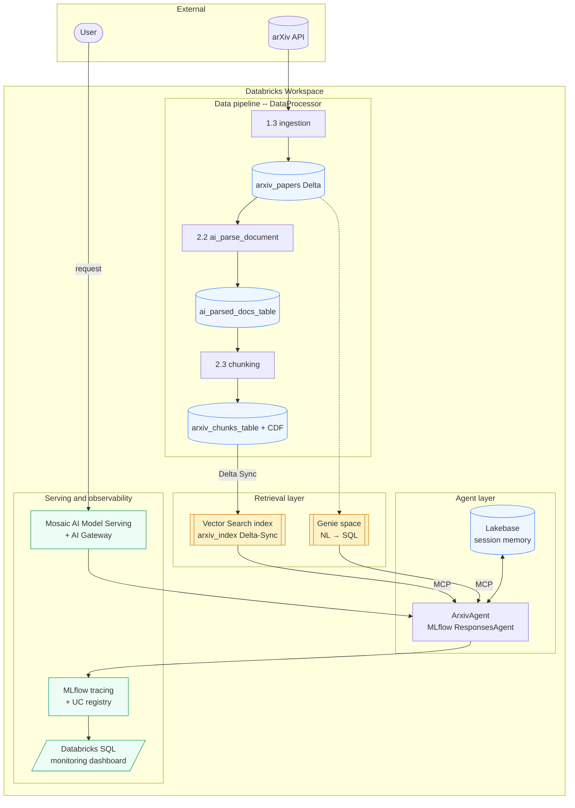

# arXiv Curator — LinkedIn-Post Agent on Databricks

End-to-end LLMOps project on Databricks. The agent ingests recent
arXiv papers, parses them into searchable chunks, indexes them in a
Vector Search index, and exposes a tool-using LLM agent that
generates engaging, citation-grounded **LinkedIn posts about AI/ML
research**.

It is built around the Databricks Data Intelligence Platform — Unity
Catalog, Delta Lake, `ai_parse_document`, Vector Search, Genie spaces
(via MCP), Lakebase session memory, MLflow tracing + UC registry,
Mosaic AI Model Serving, and Databricks SQL dashboards.

---

## Table of contents

1. [What this project does](#what-this-project-does)
2. [Architecture overview](#architecture-overview)
3. [Repository layout](#repository-layout)
4. [Data flow and Delta tables](#data-flow-and-delta-tables)
5. [Agent design](#agent-design)
6. [Evaluation](#evaluation)
7. [Serving and trace observability](#serving-and-trace-observability)
8. [Configuration](#configuration)
9. [Local environment](#local-environment)
10. [Deployment](#deployment)
11. [Testing](#testing)

---

## What this project does

The agent answers a user request such as *"draft me a LinkedIn post
about recent advances in retrieval-augmented generation"* by:

1. **Searching** the Vector Search index over recent arXiv chunks
   (via Databricks-managed MCP) for the topic the user mentioned.
2. **Querying** the Genie space for any structured insights
   (counts, recent papers, category breakdowns) over the
   `arxiv_papers` Delta table.
3. **Composing** a 150–250 word LinkedIn post that highlights key
   findings, makes the work approachable, cites the relevant
   arXiv ids, and ends with 2–3 hashtags.
4. **Persisting** the conversation turn into Lakebase so a follow-up
   ("make it shorter, focus on healthcare") refines the previous
   draft instead of starting over.

Every turn is traced through MLflow with `AGENT → LLM → TOOL`
spans, and every deployed call is later post-evaluated by a
scheduled job that runs Guidelines-based judges and code scorers
on a sample of traffic.

---

## Architecture overview



Key building blocks:

| Building block | Where it appears |
|---|---|
| `ai_parse_document` | `notebooks/2.2_pdf_parsing_ai_parse.py` and `data_processor.parse_pdfs_with_ai` |
| Vector Search (Delta-Sync) | `vector_search.VectorSearchManager` |
| Genie space (MCP) | wired into the agent via `mcp.create_mcp_tools` |
| Lakebase session memory | `memory.LakebaseMemory` |
| MLflow `ResponsesAgent` | `agent.ArxivAgent` |
| Mosaic AI Model Serving + AI Gateway | `serving.serve_model` |
| Asset Bundle resources | `resources/*.yml` |

---

## Repository layout

```
arxiv_curator/
├── src/arxiv_curator/                <- Reusable Python package
│   ├── agent.py                      <- ArxivAgent (MLflow ResponsesAgent)
│   ├── config.py                     <- Pydantic config + YAML loader
│   ├── data_processor.py             <- arXiv → PDF → parse → chunks pipeline
│   ├── evaluation.py                 <- Guidelines + code scorers
│   ├── evaluation_pg.py              <- Extended scorer suite + LLM judge
│   ├── mcp.py                        <- MCP tool factory (VS + Genie)
│   ├── memory.py                     <- LakebaseMemory (Postgres session store)
│   ├── serving.py                    <- Model-serving endpoint helper
│   ├── vector_search.py              <- VectorSearchManager (endpoint + index)
│   └── utils/common.py               <- MLflow / widget helpers
│
├── notebooks/                        <- Course-aligned notebooks (1.x .. 6.x)
│   ├── 1.1 .. 1.4_*                  <- Foundation models, throughput, ingestion
│   ├── 2.1 .. 2.4_*                  <- Context engineering, parsing, chunking, VS
│   ├── 3.1 .. 3.6_*                  <- Custom tools, MCP, memory, SPN auth
│   ├── 4.1 .. 4.5_*                  <- Tracing, custom agent, evaluation, MLflow
│   ├── 5.1 .. 5.2_*                  <- Endpoint deploy + SPN permissions
│   └── 6.1_propagate_traces.py       <- Demo traffic + trace propagation
│
├── resources/                        <- Databricks Asset Bundle resources
│   ├── arxiv_data_ingestion_job.yml  <- arXiv ingestion job
│   ├── process_data.yml              <- Scheduled ingestion + processing pipeline
│   ├── register_deploy_agent.yml     <- Agent register + deploy workflow
│   ├── update_traces_aggregated.yml  <- Daily trace aggregation + scoring job
│   ├── foundation_models_overview_job.yml
│   ├── provisioned_throughput_deployment_job.yml
│   ├── external_models_custom_provider_job.yml
│   ├── arxiv_agent_pg_job.yml
│   ├── deployment_scripts/
│   │   ├── deploy_agent.py           <- databricks.agents.deploy wrapper
│   │   ├── log_register_agent.py     <- MLflow log + UC register
│   │   ├── process_data.py           <- DataProcessor.process_and_save
│   │   └── update_traces_aggregated.py
│   └── dashboard/
│       └── agent_monitoring_dashboard.lvdash.json
│
├── tests/                            <- Pytest suite
├── arxiv_agent.py                    <- Reference (course) agent entry
├── arxiv_agent_pg.py                 <- Production agent entry (model-as-code)
├── databricks.yml                    <- Asset Bundle root
├── project_config.yml                <- Per-env config + system prompt
├── eval_inputs.txt                   <- Seed evaluation questions
├── pyproject.toml                    <- uv-managed package definition
└── version.txt
```

---

## Data flow and Delta tables

The `DataProcessor` (`src/arxiv_curator/data_processor.py`) drives
the end-to-end ingestion and curation:

```
   arXiv API
      ↓ (download_and_store_papers)
   PDFs in Unity Catalog Volume + arxiv_papers (Delta)
      ↓ (parse_pdfs_with_ai → ai_parse_document)
   ai_parsed_docs_table
      ↓ (process_chunks)
   arxiv_chunks_table   (CDF enabled)
      ↓ (VectorSearchManager.create_or_get_index + sync)
   Vector Search index: arxiv_index
```

| Table | Key columns | Notes |
|---|---|---|
| `arxiv_papers` | `arxiv_id` (PK), `title`, `authors[]`, `summary`, `published`, `processed`, `volume_path` | One row per paper; MERGE on `arxiv_id` keeps re-runs idempotent |
| `ai_parsed_docs_table` | `path`, `parsed_content` (JSON), `processed` | Output of `ai_parse_document` |
| `arxiv_chunks_table` | `id` (PK), `arxiv_id`, `chunk_id`, `text`, `title`, `summary`, `authors`, `year/month/day` | Cleaned + flattened chunks; Change Data Feed enabled for VS sync |
| Vector index `arxiv_index` | `id`, `text`, embedding | Delta-Sync index on `arxiv_chunks_table`; embeddings produced by the configured embedding endpoint |

Ingestion runs on a schedule (`resources/process_data.yml` — daily
06:00 Europe/London) and is also runnable on-demand via
`bundle run`.

---

## Agent design

`ArxivAgent` (`src/arxiv_curator/agent.py`) is an MLflow
`ResponsesAgent` that owns:

- **MCP tools** (`mcp.create_mcp_tools`) discovered from two
  Databricks-managed MCP servers — Vector Search over `arxiv_index`
  and the configured Genie space.
- **System prompt** (`project_config.yml: system_prompt`) framing the
  agent as a LinkedIn content-creation assistant with explicit style
  guardrails (150–250 words, citations, hashtags).
- **Lakebase memory** (`LakebaseMemory`) — per-session message log in
  managed Postgres so multi-turn refinements (`"shorten this"`,
  `"more technical tone"`) carry context. Optional; falls back to
  stateless if `lakebase_project_id` is unset.
- **Tool-call loop** (`_run_tool_loop`) with a `max_iter` safety rail
  and an explicit `output_to_responses_items_stream` adapter for
  Databricks' Responses-protocol endpoint.
- **Tracing** — every LLM call lives inside an `LLM` span; every tool
  call inside a `TOOL` span; the whole turn is wrapped in an `AGENT`
  span. `predict_stream` stamps `git_sha`, `model_serving_endpoint
  _name`, `model_version`, and `client_request_id` onto the trace.

The model-as-code entrypoint is `arxiv_agent_pg.py`, which builds the
agent from a `ModelConfig` and registers it via
`mlflow.models.set_model(...)` so the same file is the artifact at
serve time.

---

## Evaluation

The project ships two scorer modules:

- `evaluation.py` — the original course scorers (`word_count_check`,
  `polite_tone`, `hook_in_post`, `stays_in_scope`, `mentions_papers`).
- `evaluation_pg.py` — extended suite with an LLM-as-judge (`quality
  _judge`, 1–5 scale) using direct endpoint invocation via
  `mlflow.deployments` to side-step the `response_schema`
  incompatibility with Databricks Foundation Model APIs in MLflow 3.

`evaluate_agent(cfg, eval_inputs_path)` instantiates the agent (with
real VS, Genie, Lakebase wiring), runs it against `eval_inputs.txt`
(one question per line), and produces an `EvaluationResult` with
per-question scorer assessments and aggregate metrics — all logged
under the configured MLflow experiment.

`eval_inputs.txt` ships with seed prompts that exercise the agent's
tool selection (RAG, reasoning, multi-agent, prompt engineering,
hallucination detection, embeddings, etc.).

---

## Serving and trace observability

### Register + deploy

`resources/register_deploy_agent.yml` declares the workflow that:

1. **Logs + registers** the agent — `deployment_scripts/log_register
   _agent.py` calls `mlflow.pyfunc.log_model(...)` with the resource
   list (LLM endpoint, Genie space, VS index, papers table, SQL
   warehouse, embedding endpoint) and registers to Unity Catalog
   under the `latest-model` alias.
2. **Deploys** the registered model via `databricks.agents.deploy`
   with `scale_to_zero=True`, the configured `usage_policy_id` (AI
   Gateway), and the Lakebase service-principal credentials injected
   as `LAKEBASE_SP_CLIENT_ID` / `LAKEBASE_SP_CLIENT_SECRET` /
   `LAKEBASE_SP_HOST` (resolved from the `arxiv-agent-scope` Databricks
   Secret Scope at deploy time).

The deployed endpoint name follows the pattern
`arxiv-agent-endpoint-<env>-course-pg`.

### Trace aggregation + scoring

`resources/update_traces_aggregated.yml` runs daily (07:00
Europe/London) and:

- Reads the AI-Gateway inference table for un-evaluated traces.
- Runs `word_count_check` over all traces and logs feedback per
  trace.
- Samples 10% of traces and runs the Guidelines judges
  (`polite_tone`, `hook_in_post`) against them.
- Materialises a SQL view `arxiv_traces_aggregated_pg` that joins
  trace metadata, latency, tool / LLM span counts, total tokens, and
  the assessment outcomes.

The view feeds `resources/dashboard/agent_monitoring_dashboard
.lvdash.json` — a Databricks SQL dashboard showing trace volume,
latency, token spend, scorer pass rates, and tool-mix.

### Live demo traffic

`notebooks/6.1.propagate_traces.py` seeds the deployed endpoint with
a stamped `session_id` / `request_id` per question so the dashboard
drilldown can join traces back to a specific demo run via
`tags.session_id`.

---

## Configuration

`project_config.yml` is the single source of truth for per-environment
values and the agent system prompt. It contains:

- **system_prompt** — the LinkedIn-post system prompt.
- **dev / acc / prd blocks** — `catalog`, `schema`, `volume`,
  `llm_endpoint`, `embedding_endpoint`, `warehouse_id`,
  `vector_search_endpoint`, `genie_space_id`, `usage_policy_id`,
  `lakebase_project_id`, `experiment_name`.
- **model_config** — `temperature`, `max_tokens`, `top_p`.
- **vector_search** — `embedding_dimension`, `similarity_metric`,
  `num_results`.
- **chunking** — `chunk_size`, `chunk_overlap`, `separator`.

`databricks.yml` lays out the Asset Bundle:

- Three targets — `dev` (mode: development), `acc` (mode:
  production, schedules paused), `prd` (mode: production, schedules
  unpaused, prod warehouse).
- Variables — `git_sha`, `branch`, `schedule_pause_status`,
  `warehouse_id`.
- Bundle artifact built via `uv build` (a `.whl` referenced from each
  job spec under `dependencies: ../dist/*.whl`).

Replace placeholder ids in `project_config.yml` (`genie_space_id`,
`catalog`, `schema`, `vector_search_endpoint`, `lakebase_project_id`)
with your workspace values before the first deploy.

---

## Local environment

Python 3.12, `uv`-managed.

```
uv sync --extra dev
```

Then run tests:

```
uv run pytest
```

The default `pytest` config (`pyproject.toml [tool.pytest.ini_options]`)
includes `tests/` and adds the project root to `pythonpath`. The
suite uses simple fakes / mocks and does not require a Databricks
Connect session.

---

## Deployment

Each Asset Bundle target maps to a Databricks workspace + root
path:

```
# Deploy to dev
databricks bundle deploy --target dev

# Run the data pipeline (one-off; the YAML schedules it nightly)
databricks bundle run data-pipeline --target dev

# Register + deploy the agent
databricks bundle run register_deploy_agent --target dev

# Run trace aggregation on demand
databricks bundle run update-and-evaluate-traces --target dev
```

Workflow names available out of the box:

| Workflow | Purpose | Schedule |
|---|---|---|
| `arxiv_data_ingestion` | One-shot arXiv ingestion notebook | manual |
| `data-pipeline` | Ingest → process → save chunks → sync VS | daily 06:00 Europe/London |
| `register_deploy_agent` | Log → register → deploy agent | manual / on PR merge |
| `update-and-evaluate-traces` | Score new traces, refresh aggregated view | daily 07:00 Europe/London |
| `foundation_models_overview` / `provisioned_throughput_deployment` / `external_models_custom_provider` / `arxiv_agent_pg_job` | Topic-aligned course exercises | manual |

---

## Testing

```
uv run pytest
```

The current suite covers basic invariants in `tests/test_basic.py`.
Add new modules under `tests/` to cover agent routing, tool dispatch,
or memory behavior — the agent is constructed with injected
collaborators (MCP tools, Lakebase memory) so unit tests can pass in
fakes without touching Databricks.
